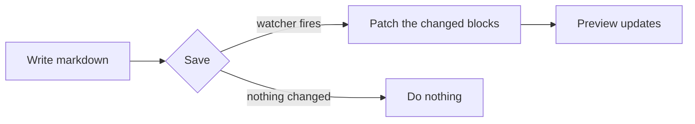

# Markdown in mark

Everything this app renders, with the source next to the result.

This page is not a description of the renderer. It **is** a render: mark parses
and draws this file with exactly the code it uses on your own documents, in
whichever theme you have chosen. If a construct below looks wrong here, it is
wrong everywhere.

> [!NOTE]
> Throughout, the code block is what you type and whatever follows it is what
> mark draws. The last section lists the things that look like markdown and are
> deliberately **not** supported, so you can stop trying them.

You can read this outside the app too — it ships inside `mark.app`:

```sh
mark render "$(mdfind -name mark.app | head -1)/Contents/Resources/markdown-reference.md"
```

## Headings

Six levels, with `#`. The two top levels can also be written by underlining.

````markdown
# Level one
## Level two
### Level three
#### Level four
##### Level five
###### Level six

Level one, underlined
=====================

Level two, underlined
---------------------
````

Every heading on this page is one of those, which is the demonstration.

**Headings carry anchors**, and the anchor is what `mark goto` and an
in-document link take. It is the heading text lowercased, with runs of
non-alphanumeric characters dropped and spaces, hyphens and underscores turned
into `-`:

| Heading | Anchor |
|---|---|
| `## Headings` | `#headings` |
| `## Task lists` | `#task-lists` |
| `## Math (MathML)` | `#math-mathml` |
| `## What isn't supported` | `#what-isnt-supported` |

```sh
mark goto '#tables'      # scrolls the front document there
```

## Paragraphs and line breaks

A blank line starts a new paragraph. A single newline inside one does **not**
break the line — that is markdown working as designed, not mark reflowing your
text.

To break a line without starting a paragraph, end it with **two spaces** or with
a **backslash**:

````markdown
Two spaces at the end of this line␣␣
break it here.

A backslash does the same\
and is easier to see in a diff.
````

(`␣` is a space, drawn here because two invisible ones at the end of a line are
exactly as hard to review as they sound.)

Two spaces at the end of this line  
break it here.

A backslash does the same\
and is easier to see in a diff.

Three or more `-`, `*` or `_` on their own line is a horizontal rule:

````markdown
---
````

---

## Emphasis

````markdown
*italic* and _italic_
**bold** and __bold__
***bold italic***
~~struck through~~
`inline code`
````

*italic* and _italic_ · **bold** and __bold__ · ***bold italic*** ·
~~struck through~~ · `inline code`

Inside `inline code` nothing is interpreted, so `**this**` stays as you wrote
it. If the code itself contains a backtick, fence it with two:

````markdown
``a ` backtick``
````

``a ` backtick``

## Lists

Bullets take `-`, `*` or `+`. Numbers take `1.` — and the numbers you write are
ignored except for the first, so a list that reads `1. 1. 1.` still renders
1, 2, 3.

````markdown
- coffee
- tea
  - green
  - black
- water

1. wake up
2. make coffee
   1. grind
   2. pour
3. read
````

- coffee
- tea
  - green
  - black
- water

1. wake up
2. make coffee
   1. grind
   2. pour
3. read

Start an ordered list somewhere else by numbering the first item:

````markdown
7. seven
8. eight
````

7. seven
8. eight

Indent to keep a paragraph, a quote or a code block inside a list item:

````markdown
- The item.

  A second paragraph belonging to it.
````

- The item.

  A second paragraph belonging to it.

## Task lists

A list item beginning with `[ ]` or `[x]` becomes a checkbox — a real one.

````markdown
- [x] Write the reference
- [ ] Read the reference
- [ ] Tick this box
````

- [x] Write the reference
- [ ] Read the reference
- [ ] Tick this box

**Clicking a checkbox writes one byte to your file** — the character between the
brackets — and nothing else. The document is re-parsed immediately before the
write, and if the target is no longer a task marker the write is refused rather
than guessed.

The boxes on *this* page are the exception: it lives inside the app bundle, so
clicking one is refused and logged.

The CLI does the same thing from a script:

```sh
mark tasks notes.md --open --json     # every unticked task, with byte spans
mark check notes.md --item 3 --toggle # flip one
```

## Links

````markdown
[an inline link](https://example.com)
[with a title](https://example.com "Hover me")
[a reference link][ref]
<https://example.com>
[jump to Tables](#tables)
[another note](./notes.md)

[ref]: https://example.com "Optional title"
````

[an inline link](https://example.com) ·
[with a title](https://example.com "Hover me") ·
[a reference link][ref] ·
<https://example.com> ·
[jump to Tables](#tables)

[ref]: https://example.com "Optional title"

Three behaviours worth knowing:

- **A bare URL is not a link.** `https://example.com` typed on its own stays
  text. Wrap it in `<…>` or in `[…](…)`.
- **A `#anchor` link scrolls this document**, the same jump `mark goto` makes.
- **A relative link to a `.md` file opens it in mark**, in place of the document
  you are reading. Anything else — `http`, `https`, `mailto` — goes to your
  browser or mail app.

## Images

````markdown


````

Paths are resolved relative to the document. Images are capped at the width of
the text column.

## Code

Inline code takes single backticks. A block takes three, and the word after them
picks the syntax:

`````markdown
```rust
fn main() {
    println!("hello");
}
```
`````

```rust
fn main() {
    println!("hello");
}
```

Indenting by four spaces also makes a code block, with no language:

````markdown
    $ mark render notes.md --plain
````

    $ mark render notes.md --plain

**On languages.** The word after the backticks is matched against the syntax
set, by name *or* by file extension, case-insensitively — so `js`, `javascript`,
`rb`, `py`, `c++` and `cpp` all work. A word the set does not know is not an
error: the block renders as plain, unhighlighted text.

Highlighted today: `bash` `c` `c++` `clojure` `cs` `css` `d` `diff` `erlang`
`go` `groovy` `haskell` `html` `java` `javascript` `json` `latex` `lisp` `lua`
`makefile` `markdown` `matlab` `objective-c` `ocaml` `pascal` `perl` `php`
`python` `r` `ruby` `rust` `scala` `sql` `xml` `yaml`.

> [!IMPORTANT]
> Some names you would expect are **not** in the set and render plain:
> `swift`, `typescript`, `tsx`, `toml`, `kotlin`, `scss`, `dockerfile`,
> `powershell`. They are not misspelled and the theme is not broken — the
> syntax simply is not there. `mark render --html` marks such a block
> `data-plain="1"` so a script can tell the difference.

## Blockquotes

````markdown
> A quote.
>
> > And one inside it.
````

> A quote.
>
> > And one inside it.

### Alerts

A blockquote whose first line is one of five markers is drawn as an alert:

````markdown
> [!NOTE]
> Something worth knowing.

> [!TIP]
> A shortcut.

> [!IMPORTANT]
> Do not skip this.

> [!WARNING]
> This can bite.

> [!CAUTION]
> This will bite.
````

> [!NOTE]
> Something worth knowing.

> [!TIP]
> A shortcut.

> [!IMPORTANT]
> Do not skip this.

> [!WARNING]
> This can bite.

> [!CAUTION]
> This will bite.

The marker must be the whole of the first line, in capitals, in square brackets
after a `!`. Anything else is an ordinary quote.

## Tables

Pipes make the columns. The first row is the header, the row of dashes under it
is required and sets each column's alignment, and the pipes do not have to line
up.

````markdown
| Command | What it does | Needs the app |
|:--------|:------------:|--------------:|
| `mark toc` | The heading tree | no |
| `mark open` | Opens a tab | yes |
| `mark theme` | Recolours every tab | yes |
````

| Command | What it does | Needs the app |
|:--------|:------------:|--------------:|
| `mark toc` | The heading tree | no |
| `mark open` | Opens a tab | yes |
| `mark theme` | Recolours every tab | yes |

`:---` is left, `:---:` is centre, `---:` is right, and a bare `---` is left. A
table wider than the column scrolls sideways rather than squeezing.

## Footnotes

````markdown
A claim that needs a source.[^where]

[^where]: The source, written just below the paragraph that cites it.
````

A claim that needs a source.[^where]

[^where]: The source, written just below the paragraph that cites it.

The label is yours — `[^where]`, `[^1]`, `[^why-not]` — and only has to match
its definition. The number is not: they are numbered in the order they are
first cited.

**A definition renders where you wrote it**, not collected at the foot of the
page. Put all of them at the bottom of the file if that is where you want them
to appear; the reference marker links to wherever they are either way.

## Math (MathML)

`$…$` is inline, `$$…$$` is its own centred block. Both are TeX, and both are
rendered to MathML **in Rust, ahead of time** — there is no JavaScript on the
page and no network request.

````markdown
The area is $\pi r^2$, and the sum

$$\sum_{n=1}^{\infty} \frac{1}{n^2} = \frac{\pi^2}{6}$$

converges.
````

The area is $\pi r^2$, and the sum

$$\sum_{n=1}^{\infty} \frac{1}{n^2} = \frac{\pi^2}{6}$$

converges.

Currency is safe. `Costs $5 and $10 today` and `a $ b $ c` both stay as
written — a `$` only opens an expression when what follows it looks like one,
so prose about money does not turn into mathematics.

An expression the parser cannot read gets a badge naming the problem, with your
source still there and still selectable, rather than disappearing:

````markdown
$\newcommand{\x}{y}$
````

$\newcommand{\x}{y}$

## Diagrams (Mermaid)

A fence marked `mermaid` is rendered to inline SVG, also in Rust, also ahead of
time. Two copies are drawn — one per appearance — so switching your Mac between
light and dark recolours the diagram with no re-render.

`````markdown

`````


Sequence, class, state, ER, pie, gantt and journey diagrams work the same way.
A `mermaid` fence whose contents are not a diagram at all is **not** an error —
it falls back to an ordinary code block, so a typo reads as a typo.

## Frontmatter

A block delimited by `---` (YAML) or `+++` (TOML) at the very top of a file is
metadata. It is parsed, kept out of the rendered page, and kept out of the
table of contents:

````markdown
---
title: Meeting notes
date: 2026-08-26
tags: [product, q3]
---

# Meeting notes
````

Without this, the closing `---` would be read as an underlined heading and the
whole document below it would be wrong — which is why it is on by default rather
than optional. Obsidian, Jekyll and Hugo files all work as they are.

This page has none, because you would not be able to see it.

## Raw HTML

HTML is passed through untouched:

````markdown
Text with <kbd>⌘F</kbd> and <sub>subscript</sub> and <sup>superscript</sup>.
````

Text with <kbd>⌘F</kbd> and <sub>subscript</sub> and <sup>superscript</sup>.

> [!WARNING]
> A **block-level** HTML element that wraps markdown across a blank line —
> `<details>` with paragraphs inside it, for example — is not reliable here.
> Each top-level block is wrapped for incremental re-rendering, and an element
> opened in one block and closed in another does not survive that. Keep raw HTML
> inside a single block.

## What isn't supported

These parse as ordinary text. They are listed so you know it is deliberate:

| You might type | What happens |
|---|---|
| `[[wikilink]]` | stays `[[wikilink]]` — use `[text](./note.md)` |
| `:smile:` | stays `:smile:` — paste the emoji instead 🙂 |
| `# Heading {#custom-id}` | the braces render; anchors are derived from the text |
| `H~2~O`, `x^2^` | stay literal — use `<sub>`/`<sup>`, or `$x^2$` |
| `--` and `"quotes"` | stay as typed; no smart punctuation |
| A definition list (`Term` / `: definition`) | renders as a paragraph |
| `https://example.com` on its own | stays text — see [Links](#links) |

## Where the rest of it is

- **`mark render <file> --html`** produces this page's exact markup, standalone,
  with both palettes inline and no JavaScript.
- **`mark toc <file> --json`** gives the heading tree with anchors and byte
  offsets.
- **`man mark`** documents the whole CLI, and `README.md` documents the app.
