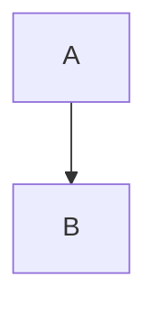

# Mixed constructs

A paragraph with *emphasis*, **strong**, ~~struck~~ text, `inline code`, and a
[link](https://example.com).

## Code

```rust
fn main() {
    println!("hello");
}
```



```bash
echo "a third highlighted fence"
```

    an indented code block

## Structure

> A blockquote
> across two lines.

- a bullet
  - nested
- [ ] a task inside a mixed document

1. first
2. second

| name | count |
|------|------:|
| a    |     1 |
| bb   |    22 |

---

Math like $x^2$ renders as MathML, and so does $$\int_0^1 f(x)\,dx$$.

A footnote reference[^note].

[^note]: The footnote body.
