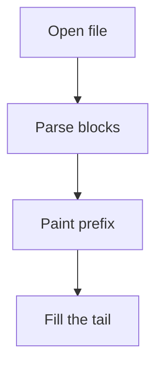
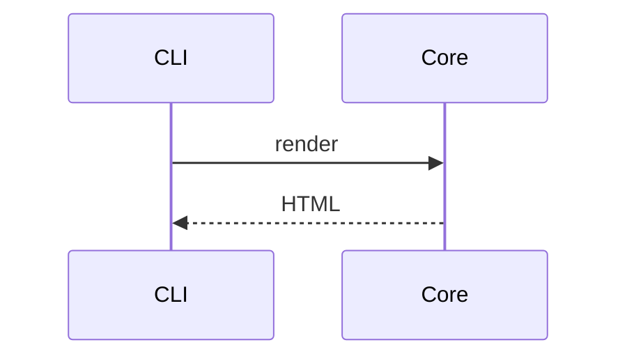

# Math and diagrams

Every construct M6's gate names, in one document, so a change to either
renderer has one place to prove itself against.

## Math that renders

Inline math like $E = mc^2$ sits in the run of text, and a display expression
gets its own line:

$$\int_{0}^{1} x^2 \,dx = \frac{1}{3}$$

Matrices, cases, and blackboard letters are all in `pulldown-latex`'s covered
set: $\mathbb{R}$, $\lim_{n \to \infty} a_n$, and
$$\begin{pmatrix} a & b \\ c & d \end{pmatrix}$$

- [x] a task whose label carries $a^2 + b^2 = c^2$
- [ ] and one that does not

## Math that does not render

`pulldown-latex` has no macro definitions, and this is the case that returns
`Ok` with an embedded `<merror>` rather than `Err`:

Defining $\newcommand{\R}{\mathbb{R}}$ produces a badge.

## Dollars that are not math

That costs $5 and $10 total, which is prose and must stay prose.

## A diagram that renders





## A diagram that does not render

```mermaid
flowchart TD
    A[[[Start --> B
```

## A fence that is not a diagram

The info string decides, and this one says `rust`, so it must be highlighted
and never handed to `merman`.

```rust
fn main() {
    println!("flowchart TD");
}
```

A `mermaid` fence whose contents are not a diagram is an ordinary code block,
not an error:

```mermaid
this is just some prose that happens to sit in a mermaid fence
```
